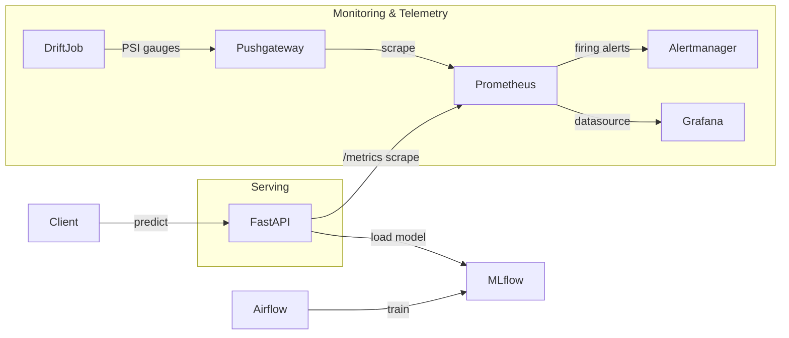

# Poker Equity MLOps Pipeline

End-to-end MLOps portfolio project, to showcase MLOps capabilities. train a poker win-equity model with PySpark and Airflow, register it in MLflow, serve predictions with FastAPI, and monitor latency, errors, and data drift with Prometheus, Alertmanager, and Grafana. The domain is a poker equity regressor. the showcase is the productionization path, train → package → schedule → serve → observe.

## Architecture



Local full stack runs on **Docker Compose**. A separate **Kubernetes** path deploys only the API (see [`infra/k8s/README.md`](infra/k8s/README.md)).

## Stack

| Layer | Tool |
|---|---|
| Language / tests | Python, Pytest |
| Batch / features | PySpark |
| Orchestration | Airflow |
| Model registry | MLflow |
| Serving | FastAPI |
| Local full stack | Docker Compose |
| API (cluster path) | Kubernetes (Deployment + Service) |
| Metrics / alerts | Prometheus, Pushgateway, Alertmanager |
| Dashboards | Grafana |
| Data store | MySQL |

## Quick start (Compose)

1. Copy `.env.example` → `.env` and set local-only passwords for MySQL and Grafana.
2. Bring the stack up:

```bash
make build
make up
```

Passwords stay in your local `.env` only. never commit that file. Grafana login uses the `GF_SECURITY_ADMIN_*` values you set there.

| Service | URL |
|---|---|
| FastAPI docs | http://localhost:5001/docs |
| Metrics | http://localhost:5001/metrics |
| Health | http://localhost:5001/health |
| MLflow | http://localhost:8080 |
| Airflow | http://localhost:18080 |
| Prometheus | http://localhost:9090 |
| Alertmanager | http://localhost:9093 |
| Grafana | http://localhost:3000 |

1. Open Airflow and trigger `training_dag` (or `fast_training_dag`).
2. After training finishes: `make refresh-app` so the API loads the latest MLflow model.
3. Call `/predict` via http://localhost:5001/docs.

Example `/predict` body:

```json
{
  "S1": 1,
  "C1": 1,
  "S2": 1,
  "C2": 13,
  "S3": 1,
  "C3": 12,
  "S4": 1,
  "C4": 11,
  "S5": 1,
  "C5": 10
}
```

Useful Make targets: `make test`, `make build`, `make up`, `make refresh-app`, `make reset`.

## Kubernetes (API only)

Compose remains the full MLOps sandbox. Kubernetes here is a second deployment story for the FastAPI serving layer only (not Airflow, MySQL, or Grafana). See [`infra/k8s/README.md`](infra/k8s/README.md).

## Project layout

```
src/                 # API, features, training, drift job
infra/docker/        # Dockerfile + Compose stack
infra/airflow/dags/  # Training DAGs
infra/telemetry/     # Prometheus, Alertmanager, Grafana provisioning
infra/k8s/           # Minimal API Deployment / Service / ConfigMap
data/raw/            # Source poker dataset
data/telemetry/      # Baseline / live distributions for PSI
tests/               # Unit (+ integration) tests
```

## Tests

```bash
make test
```

The unit tests cover features, PSI/drift helpers, and API `/health` + `/metrics` with model/Spark/MLflow mocked. A live Prometheus stack is not required for unit tests.
